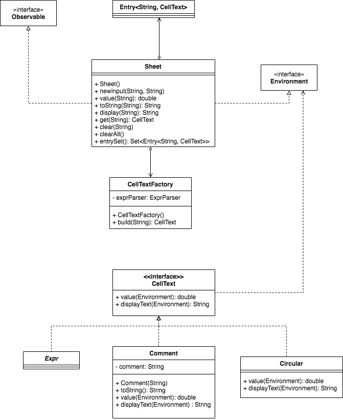

# EDAF60 XL

# Förberedelseuppgifter

**- Vilka klasser bör finnas för att representera ett kalkylark?**

Expr, som innehåller information om en rutas innehåll, och Sheet, som innehåller information om vilket Expression-objekt som finns i vilken ruta.

**- En ruta i kalkylarket skall kunna innehålla en text eller ett uttryck. Hur modellerar man detta?**

Genom att göra det till ett Expr-objekt som både kan representera en text och ett uttryck. Typ template pattern?

**- Hur skall man hantera uppdragsgivarens krav på minnesresurser?**

Genom att hålla reda på kalkylarkets innehåll i en Map, och endast lägga in objekt i denna då användaren matar in något i en ruta. Storlen på Mapen beror då av hur mycket information som matats in.

**- Vilka klasser skall vara observatörer och vilka skall observeras?**

WindowMenu och StatusLable ska vara observers medan Sheet och XLList ska vara Observable.

**- Vilket paket och vilken klass skall hålla reda på vad som är “Current slot”?**

Klassen Controller i paketet GUImenu.

**- Vilken funktionalitet är redan färdig och hur fungerar den? Titta på klasserna i view-paketet och testkör.**

Klasser för att skapa expressions, main-metod där den grafiska representationen av ett kalkylark skapas. 

**- Det kan inträffa ett antal olika fel när man försöker ändra innehållet i ett kalkylark. Då skall undantag kastas. Var skall dessa undantag fångas och hanteras?**

I Model-paketet men möjligtvis även i Controller-paketet (-klasserna) bör undantag kastas. Det finns redan felhantering i Expr-klasserna för att t.ex undvika division med noll men förmodligen behöver detta upptäckas tidigare. 

**- Vilken klass används för att representera en adress i ett uttryck?**

Variable. 

**- När ett uttryck som består av en adress skall beräknas används gränssnittet Environment. Vilken klass skall implementera gränssnittet? Varför använder man inte klassnamnet i stället för gränssnittet?**

Klassen sheet. På grund av paketets placering. 

**- Om ett uttryck i kalkylarket refererar till sig själv, direkt eller indirekt, så kommer det att bli bekymmer vid beräkningen av uttryckets värde. Föreslå något sätt att upptäcka sådana cirkulära beroenden! Det finns en elegant lösning med hjälp av strategimönstret som du får chansen att upptäcka. Om du inte hittar den så kommer handledaren att avslöja den.**

Vi byter hela tiden ut variable mot ett nytt Expr-objekt och om variabeln vi vill räkna ut finns även på högersidan vet vi att vi hittat ett cirkulärt beroende. 

# Användningsfall för XL-kalkylarket 
Användaren kommer att vilja göra beräkningar utifrån innehållet i de andra rutorna. 

Exempel: A1 = 1 + 5 --> A1 = 6. 

B5 = 2, F7 = 3*B5. --> F7 = 6.

Eventuella exceptions: Användaren använder nuvarande rutas address i det aritmetiska uttrycket, användaren matar in för många tecken, användaren trycker på en annan ruta innan den tryckt på enter, användaren försöker dividera med noll. 
# Diagram

# Gui

# Gui.menu

# Util

# Model

# Expr

